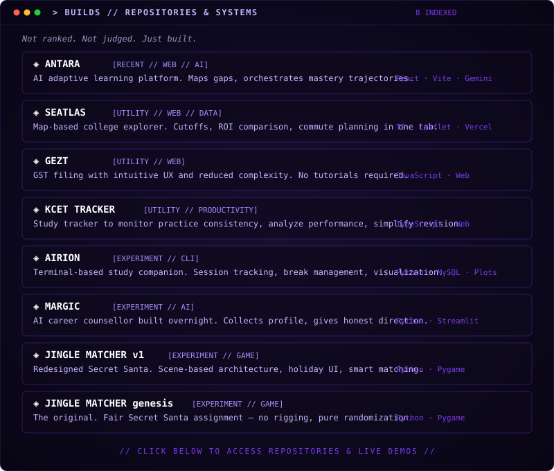
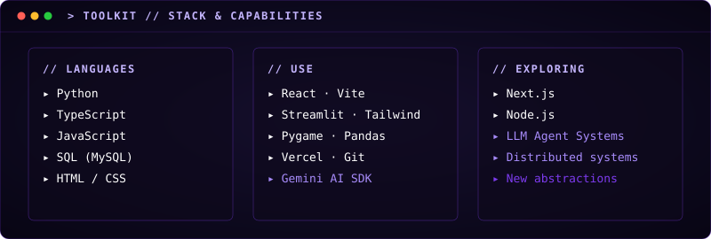
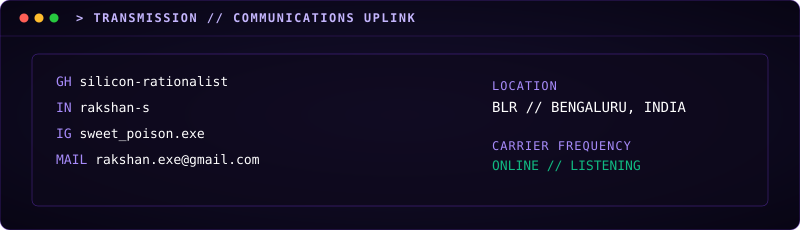

[`IDENTITY`](#-identity) · [`CURRENTLY`](#-current-state) · [`BUILDS`](#-builds) · [`TOOLKIT`](#-toolkit) · [`TRANSMIT`](#-transmission)

  
  
  
  

  

  

  

  
  
  ·
  
  
  ·
  
  

  
  ·
  
  ·
  
  ·
  
  ·
  

  

  

  
  

  
  

<code>> BUILD LOG</code>

 

