> **Professional over-thinker solving my own inefficiencies.**

 **online** — BLR · IST &nbsp;│&nbsp; nav: [identity](#identity) · [current state](#current-state) · [toolkit](#toolkit) · [builds](#builds) · [transmission](#transmission)

gh [silicon-rationalist](https://github.com/silicon-rationalist) · in [rakshan-s](https://www.linkedin.com/in/rakshan-s/) · ig [sweet_poison.exe](https://www.instagram.com/sweet_poison.exe/) · mail [rakshan.exe@gmail.com](mailto:rakshan.exe@gmail.com)

---

## IDENTITY

The loop: notice something that works badly → overthink it, unreasonably → build the smallest thing that fixes it. The build is almost always quieter than the overthinking.

Bengaluru. One developer, several small systems. Motion over milestones.

## CURRENT STATE

| process | state |
| --- | --- |
| `building` | **ANTARA** — adaptive learning platform · `react` `typescript` `gemini` |
| `learning` | react + typescript, one real app at a time |
| `exploring` | GST filing, minus the suffering · `GEZT` |
| `trying to understand` | `// undefined — it gets defined slowly` |

## TOOLKIT

`▣ in use` · `◇ ramping (recent, still sharp)`

| domain | load |
| --- | --- |
| `languages` | ▣ `python` `c` `sql` `html/css` |
| `ramping` | ◇ `typescript` `javascript` `react` |
| `ui / build` | ▣ `streamlit` `pygame` `vite` `tailwind` `leaflet` |
| `data` | ▣ `pandas` `mysql` `sqlalchemy` `matplotlib` |
| `ai` | ▣ `gemini api` |

## BUILDS

`08 builds + this interface — every one started as a problem I had myself.`

### FEATURED

**◈ [ANTARA](https://github.com/silicon-rationalist/ANTARA)** `current`
Adaptive learning platform — finds the exact gap, not just the wrong answer.
`typescript` `react` `gemini`
`# youngest build in the system — still compiling`

**◈ [Seatlas](https://github.com/silicon-rationalist/Seatlas)** `deployed`
Colleges on a map: cutoffs, ROI, commute — one click each, no ten tabs.
`typescript` `leaflet` `vercel` · [live](https://seatlas.vercel.app)
`# crossed 1000+ organic views after one honest post`

**◈ [margic](https://github.com/silicon-rationalist/margic)** `award`
AI career counsellor for students who can't afford one.
`python` `streamlit` `gemini` · [deck](https://1drv.ms/p/c/82daeec0c06839ac/IQB4dJDtKheCQIq7khaYWTnKAZANWhz1OSX0O11Ldkvrakg?e=Gs9FOF)
`# built in one night, on a deadline. won 1st place anyway.`

### THE REST

**▣ [GEZT](https://github.com/silicon-rationalist/GEZT)** `utility`
GST filing, rebuilt with less complexity and fewer pre-requisites.
`javascript` `vite`
`# tax season, but make it usable`

**▣ [KCET_Tracker](https://github.com/silicon-rationalist/KCET_Tracker)** `tooling`
Exam-prep tracker — sessions, answers, answer-key checks, patterns over time.
`typescript`
`# built because the same questions felt different on different days`

**▣ [AIRION](https://github.com/silicon-rationalist/AIRION)** `utility`
CLI study companion — topics, sessions, breaks, charts in the terminal.
`python` `mysql` `pandas` `matplotlib`
`# "the battle is won in the terminal before the exam hall"`

**▣ [JINGLE_MATCHER_genisis](https://github.com/silicon-rationalist/JINGLE_MATCHER_genisis)** `origin`
Secret Santa, but actually fair. The first game ever shipped.
`python` `pygame`
`# "because rigged gift exchanges are so 2023"`

**▣ [JINGLE_MATCHER_ev1](https://github.com/silicon-rationalist/JINGLE_MATCHER_ev1)** `iterated`
The rewrite — scenes, classes, a calmer UI, no duplicate names.
`python` `pygame`
`# the first version taught the second one`

## TRANSMISSION

| ch | id |
| --- | --- |
| `gh` | [silicon-rationalist](https://github.com/silicon-rationalist) |
| `in` | [rakshan-s](https://www.linkedin.com/in/rakshan-s/) |
| `ig` | [sweet_poison.exe](https://www.instagram.com/sweet_poison.exe/) |
| `mail` | [rakshan.exe@gmail.com](mailto:rakshan.exe@gmail.com) |
| `loc` | Bengaluru, India |

`responses: human timeframe, no SLA — mail has the highest priority`

build log — actual numbers, no inflation

| | |
| --- | --- |
| builds | `08` + this interface |
| public active days · last 90 | `03` |
| first build | `margic` · 2025-08 |
| newest build | `ANTARA` · 2026-09 |
| stars | `00` — honest |

The graph is small. The builds are real. That's the trade.

what is this page

A README that behaves like a small OS. The screens are generated by `make_assets.py` (python stdlib, no dependencies) — `python3 make_assets.py` rewrites everything in `assets/`. The rest is plain markdown, so updating it shouldn't require a reboot.

---

`system status: still building.`
`more terrain generating...`
