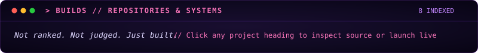

[`IDENTITY`](#-identity) · [`CURRENTLY`](#-current-state) · [`BUILDS`](#-builds) · [`TOOLKIT`](#-toolkit) · [`TRANSMIT`](#-transmission)

  
  
  
  

  

  

  

 

### [`◈ ANTARA ↗`](https://github.com/silicon-rationalist/ANTARA)
`RECENT // WEB // AI` · `● LIVE`

**Why I built it:**
AI-powered adaptive learning platform. Maps knowledge gaps, modulates diagnostic assessments, and orchestrates mastery trajectories in real time — built to turn passive studying into an active, feedback-driven loop.

`TypeScript` · `React` · `Vite` · `Gemini AI` · `Tailwind`

  
  

---

### [`◈ SEATLAS ↗`](https://github.com/silicon-rationalist/Seatlas)
`UTILITY // WEB // DATA` · `● LIVE`

**Why I built it:**
Map-based college explorer. Cutoffs, ROI comparison, commute planning — all the things that were spread across 15 browser tabs and messy PDFs, in one place.

`TypeScript` · `Leaflet` · `Vercel`

  
  

---

### [`◈ GEZT ↗`](https://github.com/silicon-rationalist/GEZT)
`UTILITY // WEB` · `● LIVE`

**Why I built it:**
GST filing with better UX and less complexity. Because government tax interfaces shouldn't require a tutorial or an accounting degree.

`JavaScript` · `Web`

  
  

---

### [`◈ KCET TRACKER ↗`](https://github.com/silicon-rationalist/KCET_Tracker)
`UTILITY // PRODUCTIVITY`

**Why I built it:**
Study tracker built to monitor practice consistency, analyze performance patterns from practice papers, and simplify daily revision cycles.

`TypeScript` · `Productivity`

  

---

### [`◈ AIRION ↗`](https://github.com/silicon-rationalist/AIRION)
`EXPERIMENT // CLI`

**Why I built it:**
Terminal-based study companion. Subject selection, session tracking, structured break management, and progress visualization directly from the shell.

`Python` · `MySQL` · `Matplotlib`

  

---

### [`◈ MARGIC ↗`](https://github.com/silicon-rationalist/margic)
`EXPERIMENT // AI`

**Why I built it:**
AI-powered career counsellor built in one night before a hackathon competition. Ingests your background context, stores a profile, and gives honest, actionable direction.

`Python` · `Streamlit` · `Gemini AI`

  

---

### [`◈ JINGLE MATCHER v1 ↗`](https://github.com/silicon-rationalist/JINGLE_MATCHER_ev1)
`EXPERIMENT // GAME`

**Why I built it:**
Redesigned Secret Santa game. Scene-based structure, festive holiday UI, and constraint-aware matching logic to ensure no self or sibling pairings.

`Python` · `Pygame`

  

---

### [`◈ JINGLE MATCHER genesis ↗`](https://github.com/silicon-rationalist/JINGLE_MATCHER_genisis)
`EXPERIMENT // GAME`

**Why I built it:**
The original build where the idea started. Fair Secret Santa assignment — no rigged slips of paper, just pure Python randomization.

`Python` · `Pygame`

  

  

  

  
  

  
  

<code>> BUILD LOG</code>

 

