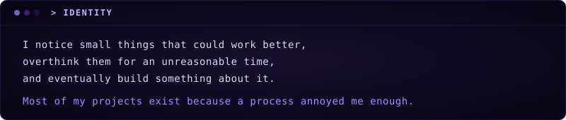
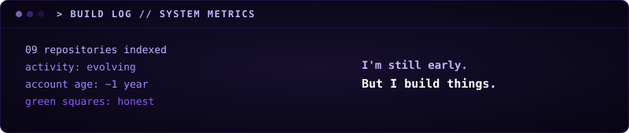

[`IDENTITY`](#-identity) · [`CURRENTLY`](#-current-state) · [`BUILDS`](#-builds) · [`TOOLKIT`](#-toolkit) · [`TRANSMIT`](#-transmission)

  
  
  
  

  

  

<h2 id="-builds"><code>&gt; BUILDS</code></h2>

Not ranked. Not judged. Just built.

 

### `◈ ANTARA`
RECENT // WEB // AI

AI-powered adaptive learning platform. Maps knowledge gaps, modulates diagnostic assessments, orchestrates mastery trajectories in real time.

`TypeScript` · `React` · `Vite` · `Gemini AI` · `Tailwind`

  
  

---

### `◈ SEATLAS`
UTILITY // WEB // DATA

Map-based college explorer. Cutoffs, ROI comparison, commute planning — all the things that were spread across 15 browser tabs, in one place.

`TypeScript` · `Leaflet` · `Vercel`

  
  

---

### `◈ GEZT`
UTILITY // WEB

GST filing with better UX and less complexity. Because tax interfaces shouldn't require a tutorial.

`JavaScript` · `Web`

  
  

---

### `◈ KCET TRACKER`
UTILITY // PRODUCTIVITY

Study tracker built to monitor practice consistency, analyze performance, and simplify revision.

`TypeScript` · `Productivity`

  

---

### `◈ AIRION`
EXPERIMENT // CLI

Terminal-based study companion. Subject selection, session tracking, break management, progress visualization.

`Python` · `MySQL` · `Matplotlib`

  

---

### `◈ MARGIC`
EXPERIMENT // AI

AI-powered career counsellor. Built in one night before a competition. Collects your background, stores a profile, gives honest direction.

`Python` · `Streamlit` · `Gemini AI`

  

---

### `◈ JINGLE MATCHER v1`
EXPERIMENT // GAME

Redesigned Secret Santa game. Scene-based structure, holiday-themed UI, smarter matching logic.

`Python` · `Pygame`

  

---

### `◈ JINGLE MATCHER genesis`
EXPERIMENT // GAME

The original. Fair Secret Santa assignment — no rigging, just randomization. Where the idea started.

`Python` · `Pygame`

  

<h2 id="-toolkit"><code>&gt; TOOLKIT</code></h2>

#### `// LANGUAGES`

  
  
  
  
  
  

#### `// USE`

  
  
  
  
  
  
  
  
  

#### `// EXPLORING`

  
  
  

<h2 id="-transmission"><code>&gt; TRANSMISSION</code></h2>

  
  

  
  

BLR // BENGALURU, INDIA

<code>> BUILD LOG</code>

 

